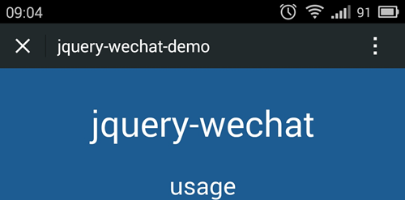

# jquery-wechat    #

=============

A jquery plugin which provides handy tools for `wechat`.

As we know, `wechat` is absolutely a successful mobile app in business level. But as a developer, i would say, the documentation is worst that i've ever seen in the popular apps.

The purpose i wrote this plugin, is help others to handle common cases without `baidu` for a whole day.

## Requirement ##

- [jquery](http://jquery.com/) (1.7+)

## Install ##

```powershell
bower install --save jquery-wechat
```

## Usage ##

```html
<script type="text/javascript" src="jquery-wechat.js"></script>
```

> Be sure add above `script` after `jQuery` loaded.

### Enable `wechat` functionality ###

#### $.wechat.enable() ####

Type: `function`

Arguments: no

Return: [promise][promise-url]

```javascript
$.wechat.enable();
```

> Otherwise, any of the function you try to use would throw error

### Hide/Show `Menu` item ###

```javascript
$.wechat.hideMenu(); //hide menu item at top-right of wechat's browser
$.wechat.showMenu(); //display menu item at top-right of wechat's browser
```




### Hide/Show `Toolbar` ###

```javascript
$.wechat.hideToolbar(); //hide toolbar at bottom of wechat's browser
$.wechat.showToolbar(); //display toolbar at bottom of wechat's browser
```


[promise-url]: http://api.jquery.com/Types/#Promise


## LICENSE ##

[MIT License](https://raw.githubusercontent.com/leftstick/jquery-wechat/master/LICENSE)
