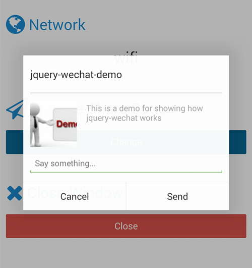

# jquery-wechat    #

=============

A jquery plugin which provides handy tools for `wechat`.

As we know, `wechat` is absolutely a successful mobile app in business level. But as a developer, i would say, the documentation is worst that i've ever seen in the popular apps.

The purpose i wrote this plugin, is help others to handle common cases without `baidu` for a whole day.

## Requirement ##

- [jquery](http://jquery.com/) (1.7+)

## Install ##

```powershell
bower install --save jquery-wechat
```

## Usage ##

```html
<script type="text/javascript" src="jquery-wechat.js"></script>
```

> Be sure add above `script` after `jQuery` loaded.

### Enable `wechat` functionality ###

#### $.wechat.enable() ####

Type: `function`  
Arguments: no  
Return: [promise][promise-url]

```javascript
$.wechat.enable();
```

> Otherwise, any of the function you try to use would throw error

### Hide/Show `Menu` item ###

#### $.wechat.hideMenu() ####

Type: `function`  
Arguments: no  
Return: no

#### $.wechat.showMenu() ####

Type: `function`  
Arguments: no  
Return: no

```javascript
$.wechat.hideMenu(); //hide menu item at top-right of wechat's browser
$.wechat.showMenu(); //display menu item at top-right of wechat's browser
```


### Hide/Show `Toolbar` ###

#### $.wechat.hideToolbar() ####

Type: `function`  
Arguments: no  
Return: no

#### $.wechat.showToolbar() ####

Type: `function`  
Arguments: no  
Return: no

```javascript
$.wechat.hideToolbar(); //hide toolbar at bottom of wechat's browser
$.wechat.showToolbar(); //display toolbar at bottom of wechat's browser
```

### Get network type ###

#### $.wechat.getNetworkType() ####

Type: `function`  
Arguments: no  
Return: [promise][promise-url]

```javascript
$.wechat.getNetworkType().done(function(response) {
    $('#network').text(response.split(':')[1]);
});
```


### Close window ###

#### $.wechat.closeWindow() ####

Type: `function`  
Arguments: no  
Return: no

### Change wechat's share settings ###

#### $.wechat.setShareOption(options) ####

Type: `function`  
Arguments: options  
Return: no

##### options #####

Type: `object`

##### options.appid #####
Type: `String/Function`
Default: ``

The `appid` you registered at [open.weixin][open-weixin-url]

##### options.img_url #####
Type: `String/Function`
Default: ``

The url of the image you'd like to use as thumbnail of the page

##### options.img_width #####
Type: `String/Function`
Default: `60`

The width of the image you'd like to use on the thumbnail of the page

##### options.img_heigth #####
Type: `String/Function`
Default: `60`

The height of the image you'd like to use on the thumbnail of the page


##### options.link #####
Type: `String/Function`
Default: `window.location.toString()`

The url of the page you'd like to share

##### options.desc #####
Type: `String/Function`
Default: `<meta name="description" content="<desc>" />`

The description of the page you'd like to share

##### options.title #####
Type: `String/Function`
Default: `document.title`

The title of the page you'd like to share

##### options.callback #####
Type: `String/Function`
Default: ``

The callback will be called once you `cancel` or `commit` the share


```javascript
$.wechat.setShareOption({
    img_url: window.location.toString() + 'img/demo.jpg',
    callback: function(response) {
        alert(response);
    }
});
```



> While you'd love to reset the options, just call $.wechat.setShareOption()


[promise-url]: http://api.jquery.com/Types/#Promise
[open-weixin-url]: https://open.weixin.qq.com


## LICENSE ##

[MIT License](https://raw.githubusercontent.com/leftstick/jquery-wechat/master/LICENSE)
