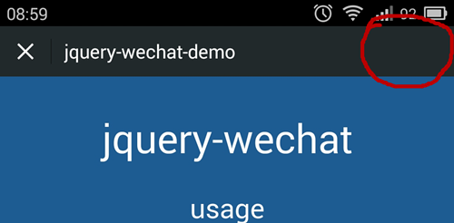
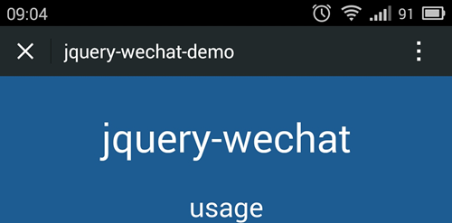
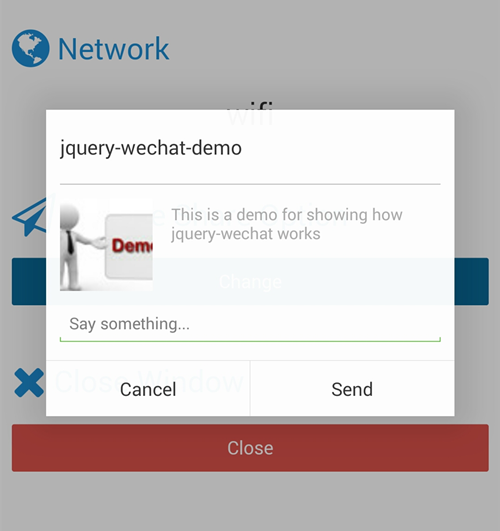
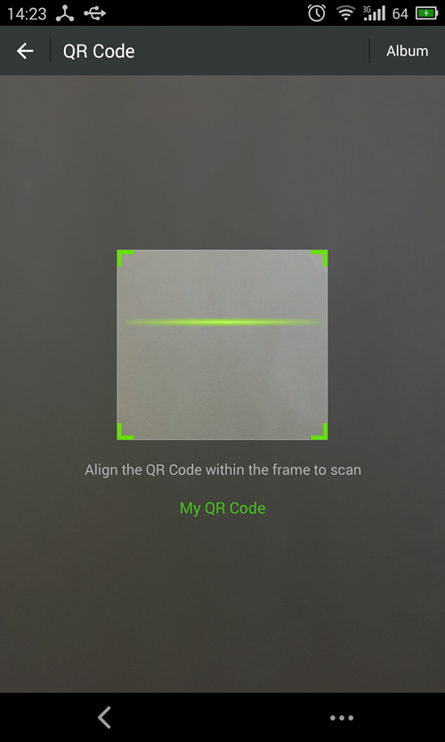
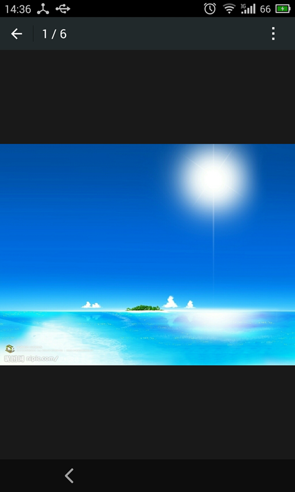

## Method ##

### $.wechat.enable() ###

Enable the `wechat` functionality.

Return: [promise][promise-url]

```javascript
$.wechat.enable();

//or

$.wechat.enable().done(function(){
    alert('wechat enabled');
});
```

> Be sure to enable the functionality at first. Otherwise, any of the function you try to use would not work

### $.wechat.hideMenu() ###

Return: [promise][promise-url]

#### $.wechat.showMenu() ####

Return: [promise][promise-url]

```javascript
$.wechat.hideMenu(); //hide menu item at top-right of wechat's browser
$.wechat.showMenu(); //display menu item at top-right of wechat's browser
```




### $.wechat.hideToolbar() ###

Return: [promise][promise-url]

#### $.wechat.showToolbar() ####

Return: [promise][promise-url]

```javascript
$.wechat.hideToolbar(); //hide toolbar at bottom of wechat's browser
$.wechat.showToolbar(); //display toolbar at bottom of wechat's browser
```

### $.wechat.getNetworkType() ###

Get network status

Return: [promise][promise-url]

```javascript
$.wechat.getNetworkType().done(function(response) {
    $('#network').text(response.split(':')[1]);
});
```


### $.wechat.closeWindow() ###

Close the `WebView`

Return: [promise][promise-url]

```javascript
$.wechat.closeWindow();
```


### $.wechat.setShareOption(options) ###

Arguments: options  
Return: no

#### options.appid ####
Type: `String/Function`
Default: ``

The `appid` you registered at [open.weixin][open-weixin-url]

#### options.img_url ####
Type: `String/Function`
Default: ``

The url of the image you'd like to use as thumbnail of the page

#### options.img_width ####
Type: `String/Function`
Default: `60`

The width of the image you'd like to use on the thumbnail of the page

#### options.img_heigth ####
Type: `String/Function`
Default: `60`

The height of the image you'd like to use on the thumbnail of the page


#### options.link ####
Type: `String/Function`
Default: `window.location.toString()`

The url of the page you'd like to share

#### options.desc ####
Type: `String/Function`
Default: `<meta name="description" content="<desc>" />`

The description of the page you'd like to share

#### options.title ####
Type: `String/Function`
Default: `document.title`

The title of the page you'd like to share

#### options.callback ####
Type: `String/Function`
Default: ``

The callback will be called once you `cancel` or `commit` the share


```javascript
$.wechat.setShareOption({
    img_url: window.location.toString() + 'img/demo.jpg',
    callback: function(response) {
        alert(response);
    }
});
```



### $.wechat.resetShareOption() ###

Reset the share options to default.

Return: no

### $.wechat.scanQRcode() ###

Goto `scanQRcode` page.

Return: [promise][promise-url]

```javascript
$.wechat.scanQRcode();
```



### $.wechat.preview(imgData) ###

Preview specified images.

Arguments: imgData  
Return: [promise][promise-url]

#### imgData.current ####
Type: `String`

The URL of init picture after you enter the preview mode 

#### imgData.urls ####
Type: `Array[String]`

The URLs of all picture would be displayed after you enter the preview mode

```javascript
$.wechat.preview({
                current: window.location.toString() + 'img/pic001.jpg',
                urls: [
                    window.location.toString() + 'img/pic001.jpg',
                    window.location.toString() + 'img/pic002.jpg',
                    window.location.toString() + 'img/pic003.jpg',
                    window.location.toString() + 'img/pic004.jpg',
                    window.location.toString() + 'img/pic005.jpg',
                    window.location.toString() + 'img/pic006.jpg'
                ]
            });
```




[promise-url]: http://api.jquery.com/Types/#Promise
[open-weixin-url]: https://open.weixin.qq.com